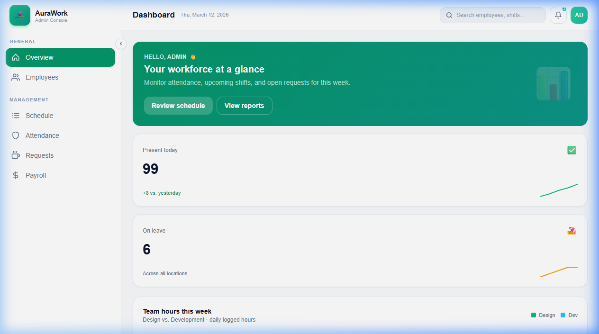
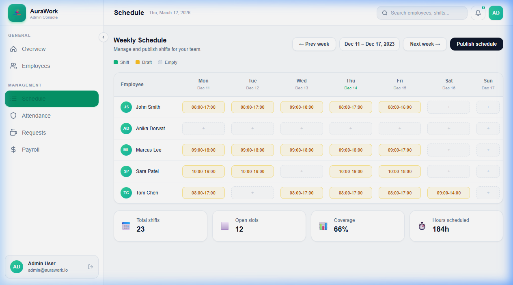
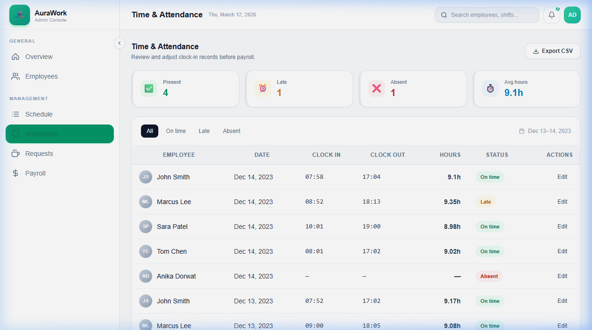
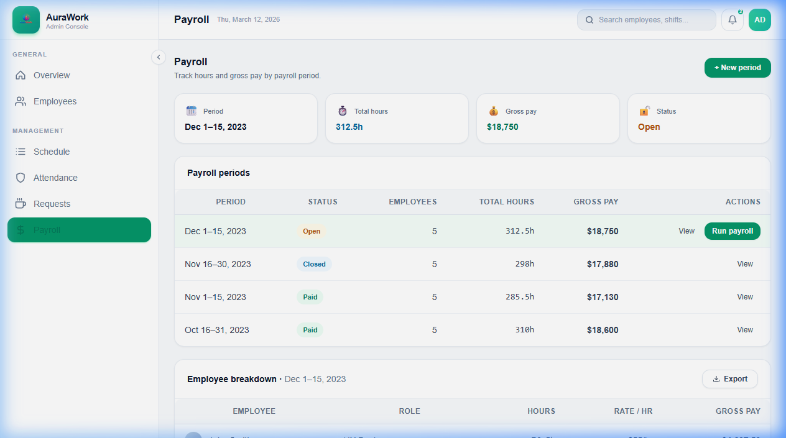
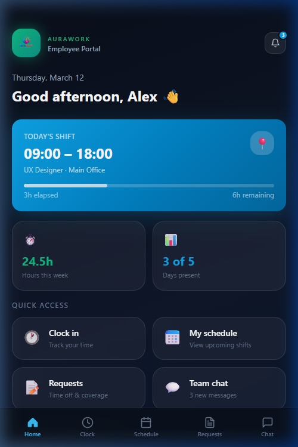
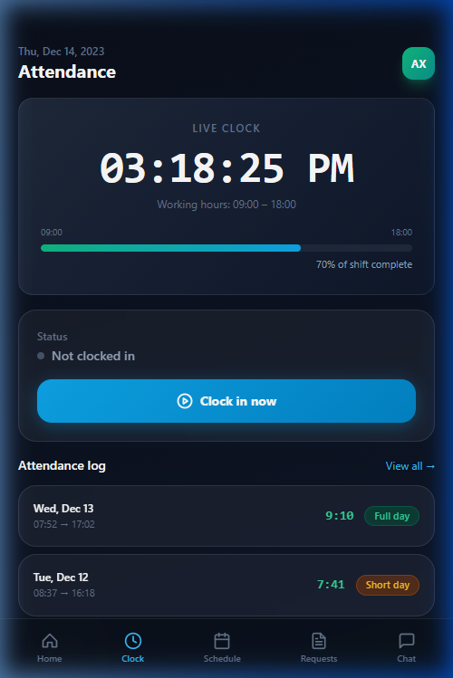
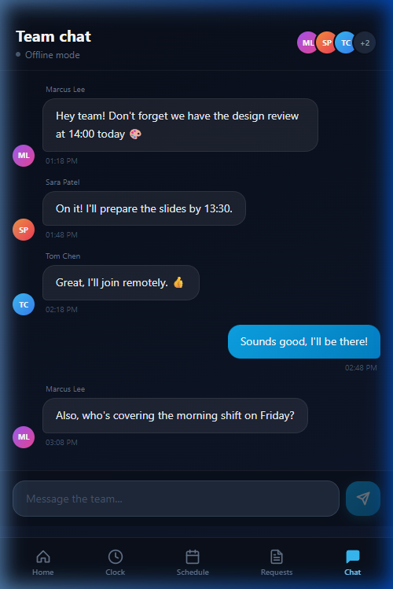

# AuraWork 🚀

AuraWork is a premium workforce management suite designed for modern businesses. It features an **Admin Console** for managers to handle scheduling, attendance, and payroll, and a mobile-first **Employee Portal** for staff to track their time, view schedules, and communicate with the team.

---

## ✨ Features

### 🖥️ Admin Console
- **Dashboard**: Real-time overview of workforce stats with interactive SVG charts.
- **Employee Management**: Comprehensive directory with status tracking.
- **Smart Scheduling**: Interactive week grid with coverage analytics.
- **Time & Attendance**: Detailed clock-in logs with status filtering (Late/Absent).
- **Request Management**: Streamlined approval workflow for time-off and swaps.
- **Automated Payroll**: Period-based breakdown of hours and gross pay.

### 📱 Employee Portal
- **Home Hub**: Quick access to shift info and personal stats.
- **Live Clock**: Precision clock-in/out with real-time elapsed timer.
- **PWA Ready**: Mobile-first design optimized for home screen installation.
- **Digital Schedule**: Mini-calendar view of upcoming shifts.
- **Requests History**: Simple form to submit and track time-off requests.
- **Team Chat**: Real-time messaging hub for team communication.

---

## 🛠️ Tech Stack
- **Frontend**: React, TypeScript, Vite
- **Styling**: Tailwind CSS, Custom Glassmorphism Design System
- **Icons**: Custom SVG Components
- **Charts**: Interactive SVG Visualizations
- **Typography**: Inter (Google Fonts)

---

## 📸 Screenshots

### Admin App
| Dashboard Overview | Smart Scheduling |
|:---:|:---:|
|  |  |

| Time & Attendance | Payroll Management |
|:---:|:---:|
|  |  |

### Employee App
| Home Hub | Live Clock | Team Chat |
|:---:|:---:|:---:|
|  |  |  |

---

## 🎬 Walkthrough Video
Check out the full app walkthrough below:


---

## 🚀 Getting Started

### Prerequisites
- Node.js (v18+)
- npm

### Installation
1. Clone the repository
   ```bash
   git clone https://github.com/prashantkandel55/AuraWork.git
   ```
2. Install dependencies
   ```bash
   npm install
   ```
3. Run Admin App
   ```bash
   cd apps/admin
   npm run dev
   ```
4. Run Employee App
   ```bash
   cd apps/employee
   npm run dev
   ```

---

## 📄 License
© 2025 AuraWork. All rights reserved.
