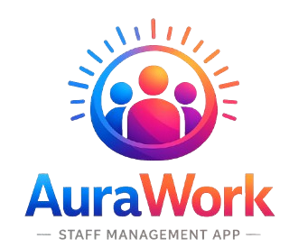

<p align="center">
  
</p>

# AuraWork 🚀

AuraWork is a premium workforce management suite designed for modern businesses. It features an **Admin Console** for managers to handle scheduling, attendance, and payroll, and a mobile-first **Employee Portal** for staff to track their time, view schedules, and communicate with the team.

---

## ✨ Features

### 🖥️ Admin Console
- **Dashboard**: Real-time overview of workforce stats with interactive SVG charts.
- **Employee Management**: Comprehensive directory with status tracking.
- **Smart Scheduling**: Interactive week grid with coverage analytics.
- **Time & Attendance**: Detailed clock-in logs with status filtering (Late/Absent).
- **Request Management**: Streamlined approval workflow for time-off and swaps.
- **Automated Payroll**: Period-based breakdown of hours and gross pay.

### 📱 Employee Portal
- **Home Hub**: Quick access to shift info and personal stats.
- **Live Clock**: Precision clock-in/out with real-time elapsed timer.
- **PWA Ready**: Mobile-first design optimized for home screen installation.
- **Digital Schedule**: Mini-calendar view of upcoming shifts.
- **Requests History**: Simple form to submit and track time-off requests.
- **Team Chat**: Real-time messaging hub for team communication.

---

## 🛠️ Tech Stack
- **Frontend**: React, TypeScript, Vite
- **Styling**: Tailwind CSS, Custom Glassmorphism Design System
- **Icons**: Custom SVG Components
- **Charts**: Interactive SVG Visualizations
- **Typography**: Inter (Google Fonts)

---

## 📸 Screenshots

### Admin App
| Dashboard Overview | Smart Scheduling |
|:---:|:---:|
|  |  |

| Time & Attendance | Payroll Management |
|:---:|:---:|
|  |  |

### Employee App
| Home Hub | Live Clock | Team Chat |
|:---:|:---:|:---:|
|  |  |  |

---

## 🎬 Walkthrough Video
Check out the full app walkthrough below:

<div align="center">
  <video src="./demo/aurawork_walkthrough.mp4" width="100%" controls autoplay muted loop>
    Your browser does not support the video tag.
  </video>
</div>

---

## 🚀 Deployment

The AuraWork suite is optimized for deployment on platforms like **Netlify** or **Vercel**.

### Deploying to Netlify (Recommended)
You can deploy the Admin and Employee apps as two separate sites:

1. **Connect your GitHub Repository** to Netlify.
2. **Admin App Settings**:
   - Base directory: `apps/admin`
   - Build command: `npm run build`
   - Publish directory: `dist`
3. **Employee App Settings**:
   - Base directory: `apps/employee`
   - Build command: `npm run build`
   - Publish directory: `dist`

### Local Production Preview
To test the production build locally:
```bash
# Admin
cd apps/admin
npm run build
npm run preview

# Employee
cd apps/employee
npm run build
npm run preview
```

---

## 📄 License
© 2025 AuraWork. All rights reserved.
